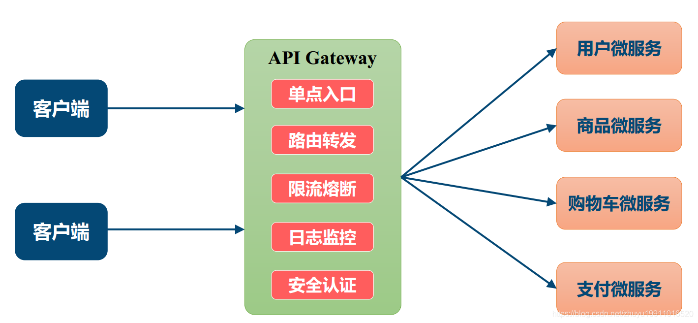
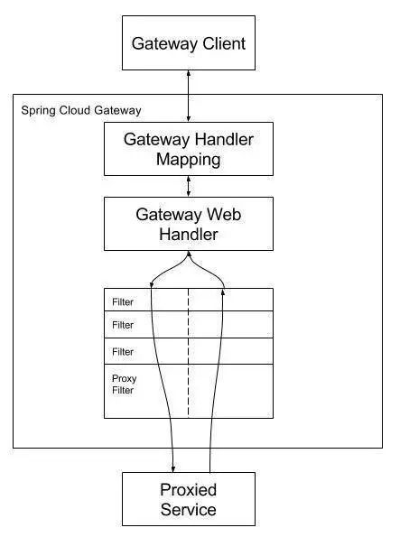
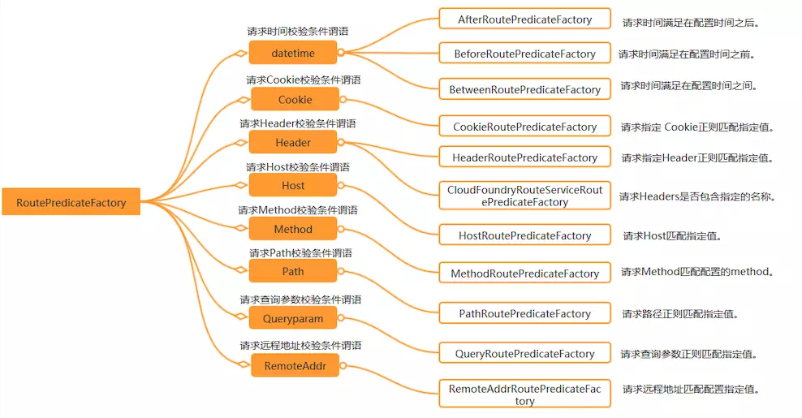
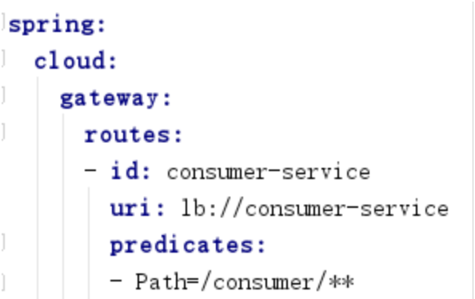
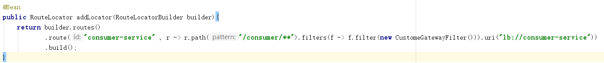

# spring cloud gateway学习笔记
## 网关的基本功能

## Spring Cloud Gateway 工作原理

客户端向 Spring Cloud Gateway 发出请求。然后在 Gateway Handler Mapping 中找到与请求相匹配的路由，将其发送到 Gateway Web Handler。Handler 再通过指 定的过滤器链来将请求发送到我们实际的服务执行业务逻辑，然后返回。过滤器之间用虚线分开是因为过滤器可能会在发送代理请求之前（“pre”）或之后（“post”）执行业务逻辑。

Filter在“pre”类型的过滤器可以做参数校验、权限校验、流量监控、日志输出、协议转换等；
在“post”类型的过滤器中可以做响应内容、响应头的修改，日志的输出，流量监控等有着非常重要的作用。

**核心逻辑就是路由转发，执行过滤器链**

## Predicate 介绍

目前用的最多的就是通过Path请求路径来匹配。有两种配置方式，通过配置文件或者代码来配置。

